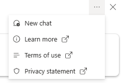
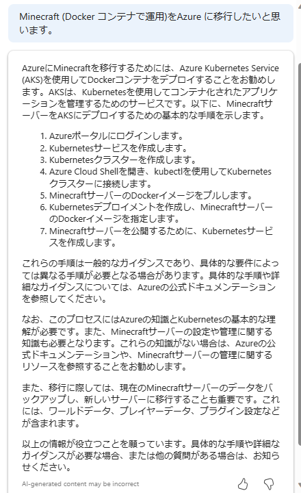

自宅で運用している(利用ユーザーは私と子どもの2名)をクラウドに載せたら、どのような構成になるか、
移行方法を調べるがてら試してみました。

## 要件の整理

自宅では、Java版(私)と統合版(子ども)で遊んでおり、双方から遊べるという要件があります。これを実現するために [Geyser](https://geysermc.org/) というプラグインを入れて、統合版から Java 版のサーバにアクセスできるようにしてます。

:::message
Geyser はサードパーティのプラグインになるため、使用に際しては自己責任で使ってください。
:::

そのため、通信要件として Java 版のクライアントからは ```25565/TCP``` 、統合版のクライアントからは ```19132/UDP``` を許可する必要があります。
また、


## Microsoft Copilot for Azureで相談

まずはざっくり相談してみました。

```
オンプレミスサーバーで運用しているコンテナアプリケーションをAzureに移行したいです。ネットワーク要件として 25565/tcp および 19132/udp を許可する必要があります。またコストは低く抑えたいです。
```

ドキュメントをいくつかピックアップしてくれましたが、どれが最適であるか、
いまいち決めきれません。




質問の仕方 (プロンプト) が悪いのでしょう。。
新規セッションを立ち上げ、ドキュメントのプロンプトの例のように段階的に質問していきます。

[Microsoft Copilot for Azure (プレビュー) を使用してインフラストラクチャを構築し、ワークロードをデプロイする](https://learn.microsoft.com/ja-jp/azure/copilot/build-infrastructure-deploy-workloads)

Mi





### 実行


###
