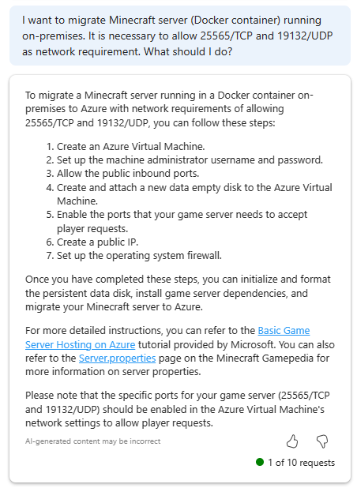
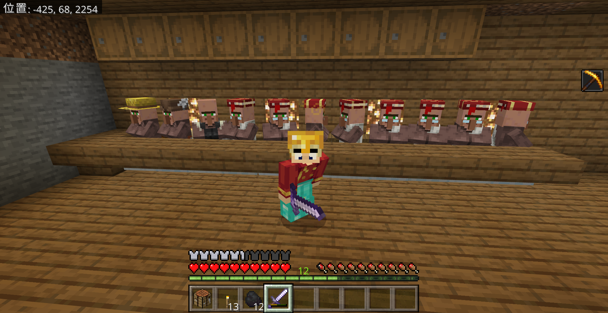
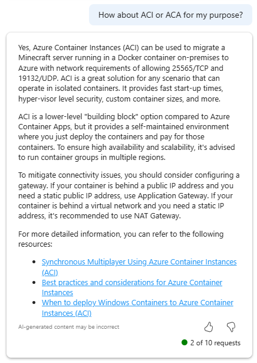

こんにちわ。
この記事は、Azure Advent Calnedar 2021 の 12/7 の記事です。

## はじめに

自宅で運用している(利用ユーザーは私と子どもの2名)をクラウドに載せたら、どのような構成になるか、移行方法を調べるがてら試してみました。

## 要件の整理

自宅では、Java版(私)と統合版(子ども)で遊んでおり、双方から遊べるという要件があります。これを実現するために [Geyser](https://geysermc.org/) というプラグインを入れて、統合版から Java 版のサーバにアクセスできるようにしてます。

:::message
Geyser はサードパーティのプラグインになるため、使用に際しては自己責任で使ってください。
:::

そのため、通信要件として Java 版のクライアントからは ```25565/TCP``` 、統合版のクライアントからは ```19132/UDP``` を許可する必要があります。
また、World データ (数十 MB) を移行する必要があります。


拠点の村人さんたち　「フゥーン、Azure ってどんなところなんだろう」

## Microsoft Copilot for Azureで相談

まずはざっくり相談してみました。

```
オンプレミスサーバーで運用しているコンテナアプリケーションをAzureに移行したいです。ネットワーク要件として 25565/tcp および 19132/udp を許可する必要があります。またコストは低く抑えたいです。
```

ドキュメントをいくつかピックアップしてくれましたが、どれが最適であるかいまいち決めきれません。



質問の仕方 (プロンプト) が悪いのでしょう。。
新規セッションを立ち上げ、ドキュメントのプロンプトの例のように段階的に質問していきます。

[Microsoft Copilot for Azure (プレビュー) を使用してインフラストラクチャを構築し、ワークロードをデプロイする](https://learn.microsoft.com/ja-jp/azure/copilot/build-infrastructure-deploy-workloads)

右上のメニューから "New chat" を選択し、新しいセッションを立ち上げます。

今度はもう少し絞って質問を投げかけてみています。
AKS を提案してもらいました。また、Azure の内容には関係ないですが、
Minecraft で移行する必要なデータも提案してくれています。

ただ、運用コスト等を鑑みると少し敷居は高いかなと思いましたので、
追加の質問を投げかけてみます。


ACI は予想された提案の一つです。
"Minecraft" , "Azure" , "コンテナ" というキーワードをひくと、
多くの事例が出てきます。


Azure Container Apps (ACA) はどうでしょうか。
こちらの結果より UDP プロトコルでのアクセスはサポートされていないようです ([Azure Container Apps でのイングレス](https://learn.microsoft.com/ja-jp/azure/container-apps/ingress-overview))。


同じように WebApp についても、TCP/UDP プロトコルのサポートとしてはないことが分かり、
仮想マシンを立ち上げることにしました。

### 実行

```bash
$ tar -czvf data.tgz data/ 
$ ls -lh
total 2.4G
drwxrwxrwx 1 yurio yurio  512 Dec  4 07:07 data
-rwxrwxrwx 1 yurio yurio 2.4G Dec  4 07:15 data.tgz
-rwxrwxrwx 1 yurio yurio 1.7K Dec  4 06:59 docker-compose.yml
drwxrwxrwx 1 yurio yurio  512 Apr 29  2023 mc-backups
-rwxrwxrwx 1 yurio yurio  261 Sep 24 15:53 mods.txt
-rwxrwxrwx 1 yurio yurio  128 Mar 26  2023 start.sh
$ scp data.tgz azureuser@74.226.225.115:/home/azureuser
data.tgz                 
```

```bash
azureuser@mcsvr:~$ tar -xzvf data.tgz 

```






###
