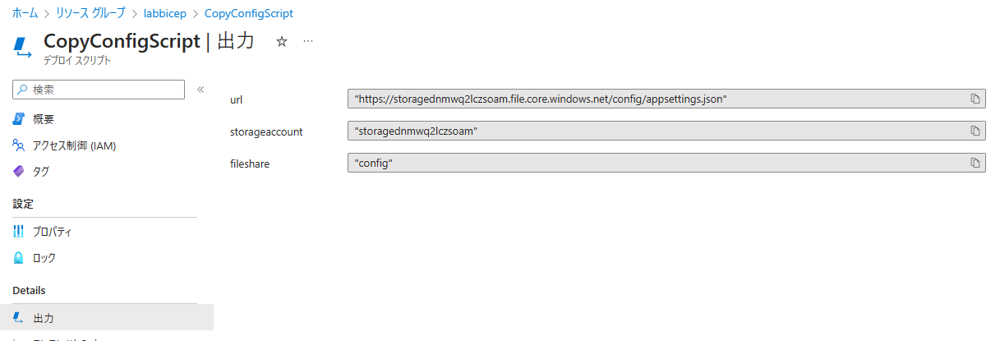

入れ子になった仮想マシンを手早く用意したい場面があったので、まとめておきます。

### 入れ子になった仮想マシンとは

入れ子になった仮想マシンとは、仮想マシンの中で仮想マシンを動作させるため、
ハイパーバイザがインストールされた仮想マシンを指します。

参考; [入れ子になった仮想化の概要](https://learn.microsoft.com/ja-jp/virtualization/hyper-v-on-windows/user-guide/nested-virtualization)

なお、入れ子になった仮想マシンについては、テストや評価目的で利用することが推奨されています。

参考; [Hyper-V VM 上の Hyper-V VM](https://learn.microsoft.com/ja-jp/virtualization/hyper-v-on-windows/user-guide/nested-virtualization#hyper-v-vms-on-hyper-v-vms)

### 方法1 az vm repair create コマンドによる

手軽に作る方法としては、仮想マシンの復旧を目的とした Azure CLI のコマンド [az vm repair](https://learn.microsoft.com/ja-jp/cli/azure/vm/repair?view=azure-cli-latest) を使う方法があります。
このコマンドは、仮想マシンが何らかの要因で起動しなくなったシナリオにおいて、復旧用の仮想マシンに対象仮想マシンの OS ディスクをアタッチし復旧作業を行う (オフライン復旧) を簡素化するコマンドになります。

既に Azure CLI をインストールされていましたら、
以下にて　```vm-repair``` 拡張機能をインストールできます。

```bash
$ az extension add -n vm-repair
```

それでは、テスト用の仮想マシンを作ります。

```bash
$ az group create -n labnestedvm -l japaneast
$ az vm create -g labnestedvm --name nestedvm --image Win2022Datacenter --admin-username azureuser --public-ip-address ""
```

:::message alert
"vm-repair" が "1.0.0b1" の場合、[Hyper-V is not installed in reapirVM #7177](https://github.com/Azure/azure-cli-extensions/issues/7177) で報告されているように、Hyper-V が有効化されない問題が報告されています。
こちらのバージョンでしたら、上記 issue にある "Backup existing script" および "Revert back" の手順にて回避可能です。

vm-repair のバージョン確認方法

```bash
$ az version
{
  "azure-cli": "2.56.0",
  "azure-cli-core": "2.56.0",
  "azure-cli-telemetry": "1.1.0",
  "extensions": {
    "ai-examples": "0.2.5",
    "ml": "2.22.0",
    "ssh": "2.0.2",
    "vm-repair": "1.0.0b1"
  }
}
```

:::

その後、復旧用の仮想マシンを作ります。その際、```--enable-nested``` を指定すると、
復旧用の仮想マシンに Hyper-V が有効化され、テスト用の仮想マシンがその仮想マシンの Hyper-V 上で稼働するようにできます。

```bash
$ az vm repair create -g labnestedvm -n nestedvm --repair-username azureuser --repair-password '<yourpassword>' --enable-nested --verbose
Does repair vm requires public ip? (y/n): y
Fetching architecture type of the source VM...
Fetching compatible Windows OS images from gallery...
Fetching available VM sizes for repair VM...
VM size 'Standard_D2s_v3' is available. Using it to create repair VM.

Checking for existing resource groups with identical name within subscription...
Pre-existing repair resource group with the same name is 'False'
Creating resource group for repair VM and its resources...
Source VM uses managed disks. Creating repair VM with managed disks.

Copying OS disk of source VM...
Creating repair VM with command: az vm create -g repair-nestedvm-20240122085949 -n repair-nestedv_ --tag repair_source=labnestedvm/nestedvm --image MicrosoftWindowsServer:WindowsServer:2016-Datacenter:2016.127.20190416 --admin-username azureuser --admin-password <yourpassword> --public-ip-address repair-nestedv_PublicIP --size Standard_D2s_v3
copy_disk_id: /subscriptions/<yoursubscription>/resourceGroups/labnestedvm/providers/Microsoft.Compute/disks/nestedvm-DiskCopy-20240122085949
repair_password: <yourpassword>
repair_username: azureuser
fix_uuid: False
Validating VM template before continuing...
Creating repair VM...
Running Script win-enable-nested-hyperv.ps1 to install HyperV
Restarting Repair VM
Running win-enable-nested-hyperv.ps1 again to create nested VM

Your repair VM 'repair-nestedv_' has been created in the resource group 'repair-nestedvm-20240122085949' with disk 'nestedvm-DiskCopy-20240122085949' attached as data disk. Please use this VM to troubleshoot and repair. Once the repairs are complete use the command 'az vm repair restore -n nestedvm -g labnestedvm --verbose' to restore disk to the source VM. Note that the copied disk is created within the original resource group 'labnestedvm'.

{
  "copied_disk_name": "nestedvm-DiskCopy-20240122085949",
  "copied_disk_uri": "/subscriptions/<yoursubscription>/resourceGroups/labnestedvm/providers/Microsoft.Compute/disks/nestedvm-DiskCopy-20240122085949",
  "created_resources": [
    "/subscriptions/<yoursubscription>/resourceGroups/repair-nestedvm-20240122085949/providers/Microsoft.Compute/virtualMachines/repair-nestedv_/extensions/MicrosoftMonitoringAgent",
    "/subscriptions/<yoursubscription>/resourceGroups/repair-nestedvm-20240122085949/providers/Microsoft.Network/networkInterfaces/repair-nestedv_VMNic",
    "/subscriptions/<yoursubscription>/resourceGroups/repair-nestedvm-20240122085949/providers/Microsoft.Compute/virtualMachines/repair-nestedv_/extensions/AzurePolicyforWindows",
    "/subscriptions/<yoursubscription>/resourceGroups/REPAIR-NESTEDVM-20240122085949/providers/Microsoft.Compute/disks/repair-nestedv__OsDisk_1_d08e2a3c2a6d4e6f887789de6e5bb989",
    "/subscriptions/<yoursubscription>/resourceGroups/repair-nestedvm-20240122085949/providers/Microsoft.Network/publicIPAddresses/repair-nestedv_PublicIP",
    "/subscriptions/<yoursubscription>/resourceGroups/repair-nestedvm-20240122085949/providers/Microsoft.Network/networkSecurityGroups/repair-nestedv_NSG",
    "/subscriptions/<yoursubscription>/resourceGroups/repair-nestedvm-20240122085949/providers/Microsoft.Network/virtualNetworks/repair-nestedv_VNET",
    "/subscriptions/<yoursubscription>/resourceGroups/repair-nestedvm-20240122085949/providers/Microsoft.Compute/virtualMachines/repair-nestedv_",
    "/subscriptions/<yoursubscription>/resourceGroups/labnestedvm/providers/Microsoft.Compute/disks/nestedvm-DiskCopy-20240122085949"
  ],
  "message": "Your repair VM 'repair-nestedv_' has been created in the resource group 'repair-nestedvm-20240122085949' with disk 'nestedvm-DiskCopy-20240122085949' attached as data disk. Please use this VM to troubleshoot and repair. Once the repairs are complete use the command 'az vm repair restore -n nestedvm -g labnestedvm --verbose' to restore disk to the source VM. Note that the copied disk is created within the original resource group 'labnestedvm'.",
  "repair_resource_group": "repair-nestedvm-20240122085949",
  "repair_vm_name": "repair-nestedv_",
  "resource_tag": "repair_source=labnestedvm/nestedvm",
  "status": "SUCCESS"
}
Command ran in 821.173 seconds (init: 0.088, invoke: 821.085)
yurio [ ~ ]$ 
```



実行されている内容としては、"az vm repair run" コマンドを内部で２回実行されており、
間に Hyper-V の有効化に伴い復旧用の仮想マシンを再起動させています。

https://github.com/Azure/azure-cli-extensions/blob/f311e026ee86c8978bab7c2caa883dad26bbb89c/src/vm-repair/azext_vm_repair/custom.py#L222-L238

"az vm repair run" で実行されている PowerShell スクリプトは、こちらの ```win-enable-nested-hyperv.ps1``` で、
１週目は下記により Hyper-V 機能の有効化を実施しています。

https://github.com/Azure/azure-cli-extensions/blob/f311e026ee86c8978bab7c2caa883dad26bbb89c/src/vm-repair/azext_vm_repair/scripts/win-enable-nested-hyperv.ps1#L118-L132

２周目は、NAT ネットワーク、DHCP、DNS の設定を行い、
アタッチされたデータディスク (元の仮想マシンの OS ディスク) を用いて仮想マシンを作っています。

https://github.com/Azure/azure-cli-extensions/blob/f311e026ee86c8978bab7c2caa883dad26bbb89c/src/vm-repair/azext_vm_repair/scripts/win-enable-nested-hyperv.ps1#L28-L116

### Azure Quick Templates を利用

https://learn.microsoft.com/en-us/samples/azure/azure-quickstart-templates/nested-vms-in-virtual-network/