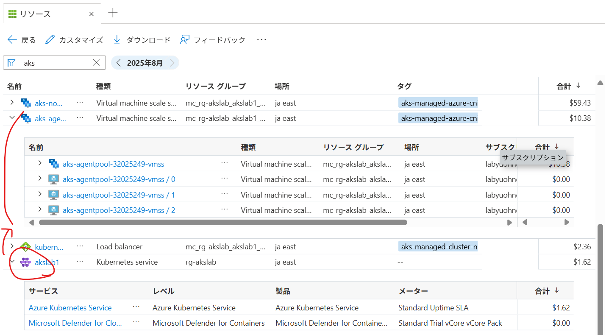

クラウドの管理において、セキュリティと併せて重要な要素がコスト管理です。
それなりの規模を持つシステムを管理する場合、多くは "共通基盤" (各ワークロードが共通で利用するリソースを集約) と、
"各業務ワークロード" (特定の業務に特化したリソース) に分けて管理されます。

このとき各業務ワークロードは、Azure においてはサブスクリプション レベルで分かれることが多く、
コストの割り当てもサブスクリプション毎で集計すればよいので容易です。

一方、Kubernetes もノードプールや名前空間によって複数の業務ワークロードが干渉しないように分けることが可能です。
この観点では Kubernetes のコストも各ワークロード毎に分けて見たいというニーズが出てきます。

# モチベーション

Azure では、クラウドのコスト管理機能として [Azure Cost Management](https://learn.microsoft.com/ja-jp/azure/cost-management-billing/costs/overview-cost-management) が提供されています。
これで、Azure Kubernetes Servcie (AKS) のコストを見てみましょう。

見ると、AKS (クラスター名 akslab1) とそれに紐づくノードプール (仮想マシン スケールセット) のコストは分かりますが、
それ以上の分解能はありません。そのため、ノードプール毎に業務ワークロードを展開する方法[^1]であれば、Cost Management 機能が使えます。

[^1]:特定のノードに Pod をスケジュールするには、[Node Selector か、Node Affinity を利用](https://learn.microsoft.com/ja-jp/azure/aks/operator-best-practices-advanced-scheduler#control-pod-scheduling-using-node-selectors-and-affinity)します。

それでは、Kubernetes において稼働するワークロードのコストをどのようにはじき出すかを Azure 観点で紹介します。

## OpenCost / KubeCost

OpenCost は CNCF によって管理されているオープンソースです。
一方、KubeCost は OpenCost をベースにエンタープライズ向けの機能 (アラートや、ガバナンス機能、予測と異常検出) を追加したプロダクトです。

https://www.apptio.com/topics/kubernetes/cost-optimization/kubecost-vs-opencost/